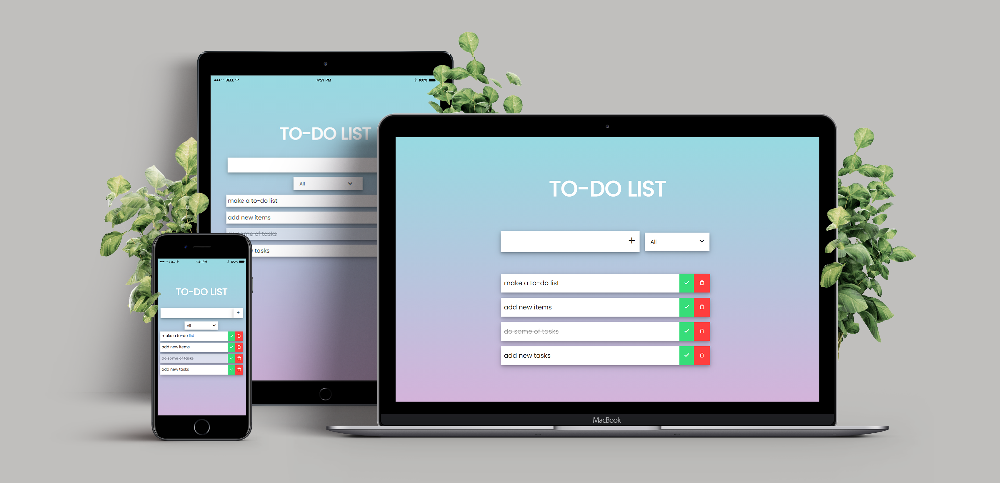

# TO-DO LIST

   

To-Do List is a web application built with React.

## Installation

If you do not have npm in your computer please download and install npm with instructions in
> https://nodejs.org/en/download/

After downloading and installing Node.js and npm, run 
#### `npm install` 
It will install requirements of To-Do List.

Then run
#### `npm start`
This command will start the application in the development mode. Open 
> [http://localhost:3000](http://localhost:3000)

to view it in the browser.

## Usage

To-Do List keeps your tasks at the cache of your browser, therefore if you do not remove cache they will not be deleted.

Any time you start server with `npm start`, your tasks will be available.

## Learn More

You can learn more in the [Create React App documentation](https://facebook.github.io/create-react-app/docs/getting-started).

To learn React, check out the [React documentation](https://reactjs.org/).

